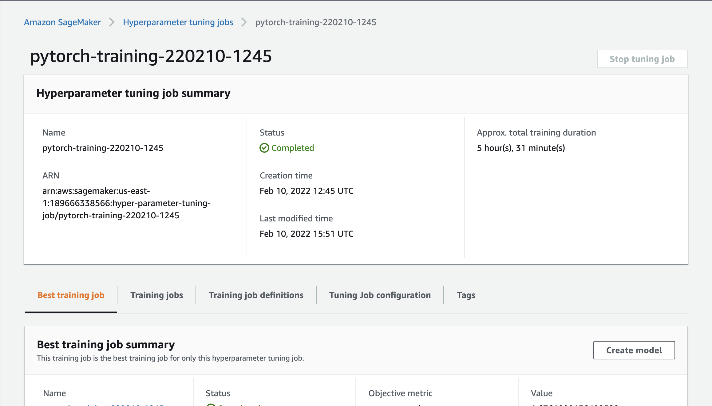

# Image Classification using AWS SageMaker

Use AWS Sagemaker to train a pretrained model that can perform image classification by using the Sagemaker profiling, debugger, hyperparameter tuning and other good ML engineering practices. This can be done on either the provided dog breed classication data set or one of your choice.

## Project Set Up and Installation
Enter AWS through the gateway in the course and open SageMaker Studio. 
Download the starter files.
Download/Make the dataset available. 

## Dataset
The provided dataset is the dogbreed classification dataset which can be found in the classroom.
The project is designed to be dataset independent so if there is a dataset that is more interesting or relevant to your work, you are welcome to use it to complete the project.

### Access
Upload the data to an S3 bucket through the AWS Gateway so that SageMaker has access to the data. 

## Hyperparameter Tuning
From a range of hyperparameters, we performed hyperparameter tuning from script `hpo.py`. This script receives parameters range as input and performs training, validation, and testing process to obtain the best estimator for model training. 

The screenshot of completed training job and the ouputs can be found below:



## Debugging and Profiling
-Use SageMaker module to complete debugging and profiling: correcting weights and undesirable effects. We plot the corss entropy loss in the Notebook.
[image info](cross_entropy_loss.png)

<br/>*Profiling*<br/>
The profiler report is generated by the SageMaker debugger and can be downloaded from [here](profiler-report.html) to be seen in your browser.
<br/>

## Model Deployment
Model is developed by a single instance training job with "ml.m5.large" instance type. 

`Inference.py` is utilized to deploy Pytorch model. 

The code sample for quering a model endpoint is as follows:
```
pytorch_model = PyTorchModel( model_data = model_data,
                            role = role,
                            entry_point= "inference.py",
                            py_version = "py36",
                            framework_version = "1.8",
                             predictor_cls = ImgPredictor
                            )

predictor = pytorch_model.deploy( initial_instance_count = 1, instance_type = "ml.m5.large")
```

